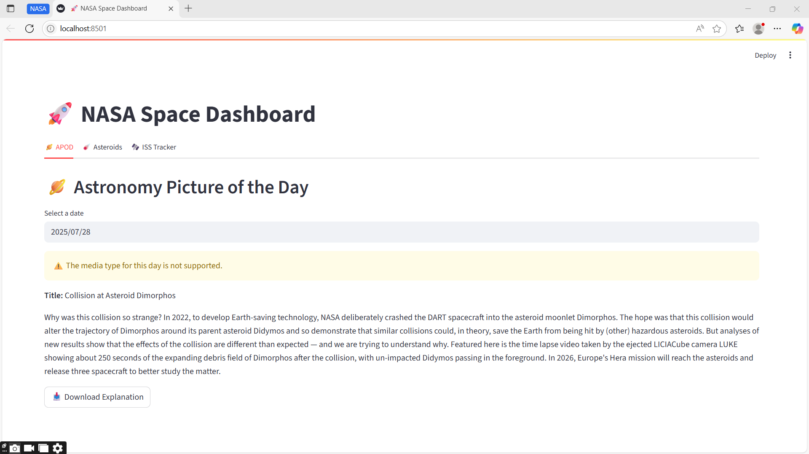

# 🚀 NASA Space Dashboard 🌌

A visually interactive space dashboard using NASA public APIs. Built with **Streamlit**, **Plotly**, and **Python**, it showcases:

- 🌠 Astronomy Picture of the Day (APOD)
- 🪐 Asteroids Near Earth
- 🛰️ ISS Tracker
- 🔴 Mars Rover Photos
- 🌤️ Space Weather (Coming Soon)
- 🧠 NASA Patents Explorer (Planned)

## 📦 Features

- Clean, tabbed Streamlit interface
- Real-time data fetched from NASA APIs
- Visualizations using Plotly
- Modular and extensible layout

## 🚀 Output Preview

Here is how the NASA Space Dashboard looks:



## 🚀 Getting Started

1. Clone the repository:

```bash
git clone https://github.com/yourusername/nasa-dashboard.git
cd nasa-dashboard
